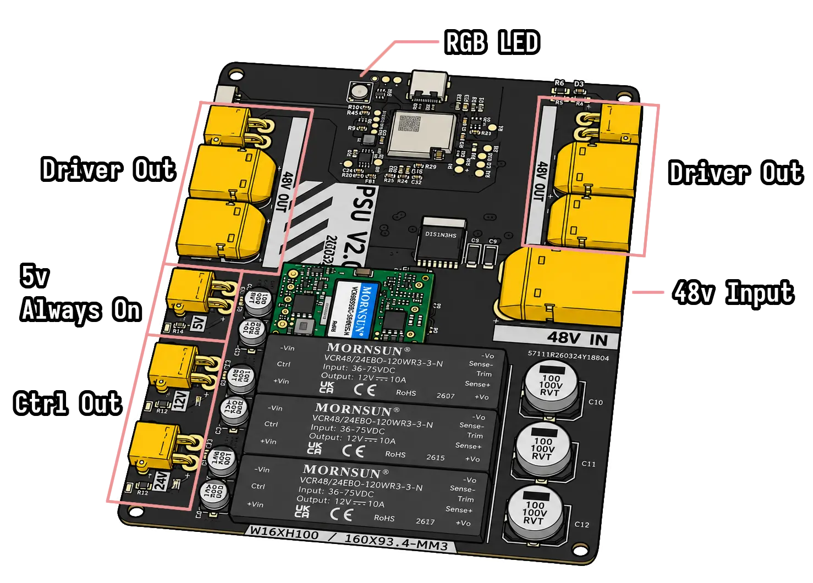
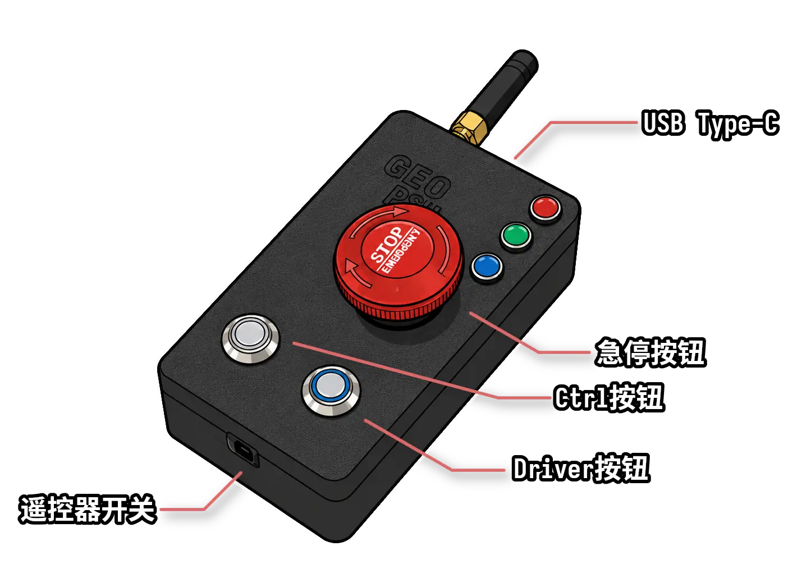
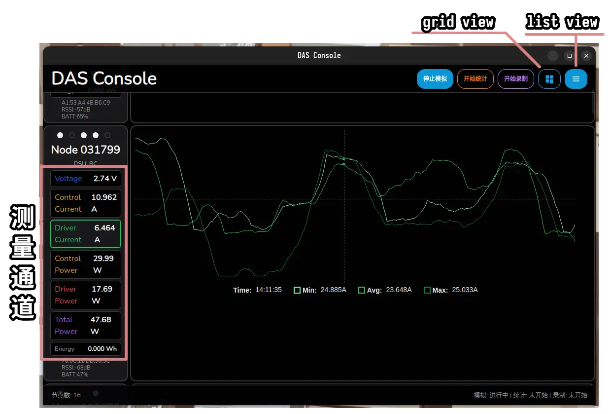

# PSU-RC 用户手册

## 一、系统概览

本系统由 **PSU 电源板** 与 **PSU-RC 遥控器** 组成，通过 ESP-NOW 无线通信（约 50m 视距）。PSU 负责电源输出与测量，遥控器负责无线控制与状态监控。

## 二、PSU 电源板

### 2.1 指示灯含义

PSU 板载一颗 WS2812 RGB LED，指示当前工作状态：

| 状态 | 灯色 | 说明 |
|------|------|------|
| **STOP（停止）** | 🔴 红色 | STOP 信号有效，Ctrl 和 Drv 均强制关闭 |
| **空闲** | 🟡 黄色 | Ctrl 未开启，输出全关 |
| **仅 Ctrl 输出** | 🔵 蓝色 | Ctrl 通道开启，Drv 通道关闭 |
| **Ctrl + Drv 全开** | ⚪ 白色 | 两个通道均开启输出 |

**链路指示：** 灯色 **常亮** = 遥控器连接正常（1s 内收到过数据）；**闪烁** = 遥控器信号丢失。

### 2.2 输出逻辑

- **Ctrl/Drv 通道**：由遥控器控制开启/关闭。
- **Drv 通道**：**依赖 Ctrl 通道** — 只有 Ctrl 开启时 Drv 才能开启；Ctrl 关闭时 Drv 自动关闭。
- **STOP 信号**：收到 STOP 时 Ctrl 和 Drv 立即强制关闭。
- **链路超时安全保护**：超过 **1 秒** 未收到遥控器数据包 → Drv 通道自动关闭，Ctrl 维持当前状态。

### 2.3 测量与广播

PSU 以 **10Hz**（每秒 10 次）向遥控器广播以下数据：
- 电源电压（V）
- Ctrl 通道电流（A）
- Drv 通道电流（A）
- 当前输出状态（Ctrl / Drv / STOP）
- 最近一次遥控器信号强度 RSSI（dBm）

## 三、PSU-RC 遥控器

### 3.1 指示灯含义

遥控器指示灯反映连接状态、通信状态与电池状态：

| 场景 | 灯效 | 说明 |
|------|------|------|
| **未绑定 + 未按下 STOP** | 🟡 所有灯慢闪烁 | 等待按下STOP |
| **未绑定 + 按下 STOP** | 🟢 绿色慢闪烁 | 正在搜索可绑定的 PSU |
| **已绑定 + 链路断开** | 🟢 绿色快闪烁 | 信号丢失，正在重连 |
| **已绑定 + 链路正常 + STOP 未按下** | 🟢 绿色常亮 | 连接正常 |
| **已绑定 + 链路正常 + STOP 按下** | 🟢 绿色 + 🔵 蓝色 | 已连接且 STOP 生效 |
| **已绑定 + 按下 Ctrl/Drv 按钮** | 🔵 蓝色快闪 | 正在发送切换请求 |
| **误操作：STOP 下按 Ctrl/Drv** | 🔴 红色快闪 | STOP 期间操作无效 |
| **电池电量低** | 🔴 红色慢闪 | 请及时充电 |
| **电池严重亏电** | **熄灭** | 自动进入深度休眠，需充电后唤醒 |

### 3.2 控制逻辑

#### 单控模式

1. **绑定 PSU**：按下 STOP 开关 → 绿色慢闪表示正在搜索 → 自动绑定信号最强的 PSU（RSSI > -85dBm）→ 绑定成功后绿色常亮。
2. **控制 Ctrl 通道**：按一下 **[Ctrl]** 按钮 → 切换 Ctrl 开/关 → 蓝色快闪表示指令发送中。
3. **控制 Drv 通道**：先确认 Ctrl 已开启 → 按一下 **[Drv]** 按钮 → 切换 Drv 开/关 → 蓝色快闪。
   - **⚠️ 注意：** 若 Ctrl 未开启时按 Drv → 无效操作，红色快闪提示。
4. **STOP 紧急停止**：拨动 **[STOP]** 开关 → 强制关闭 Ctrl 和 Drv 通道 → 遥控器指示变为绿色+蓝色。
   - 在 STOP 状态下按 Ctrl 或 Drv → 无效操作，红色快闪提示。
5. **重发保障**：每一次 Ctrl/Drv 切换指令会以 10Hz 重复发送最多 10 次，直到确认 PSU 状态已切换。

### 3.3 电池管理

| 电压状态 | 行为 |
|---------|------|
| **正常** | 正常工作，LED 状态正常 |
| **低压** | LED 红色慢闪提示，可继续使用 |
| **严重亏电** | 上电检测后自动进入深度休眠，指示灯熄灭，需充电后重新上电 |

**充电方式：** 通过 USB-C 接口充电。

### 3.4 USB 遥测

遥控器通过 USB-C 连接电脑后，会以 **USB CDC ACM 串口** 实时输出 PSU 广播的测量数据。可使用配套 [DAS](https://github.com/geometric-dynamic/DAS-app) 工具查看。

## 四、DAS 应用

### 4.1 连接

1. 打开 DAS 软件
2. 将 PSU-RC 遥控器通过 USB 连接到电脑
3. 等待软件识别到遥控(未识别可尝试重新连接)
4. 点击软件界面上的连接按钮

### 4.2 UI功能

- 模拟按钮用于生成随机节点与数据，仅用于演示或界面调试
- `grid view`和`list view`按钮用于切换视图类型
- 在 listview 下，点击不同的`测量通道`可以切换显示的图表
- 点击`开始统计`，从当前时间开始计算能量消耗
- 点击`开始录制`，从当前时间开始将所有数据保存到同目录下的log文件中
